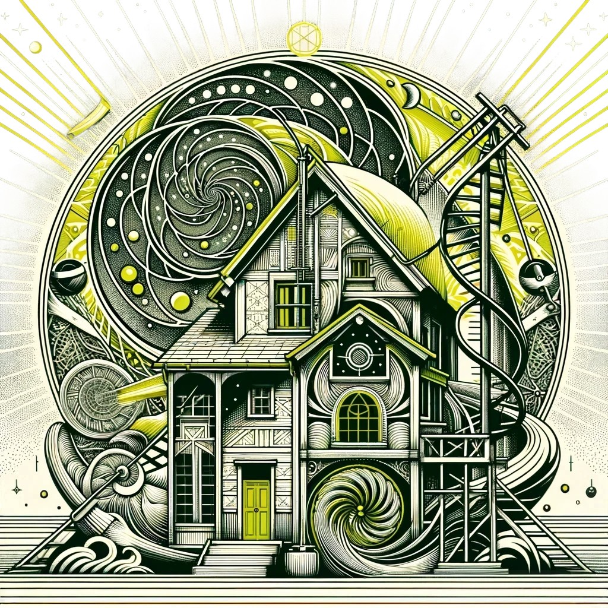

# 3N3RJ (Energy Storing and Harvesting)
A small repo to gather and develop ideas to harvest and store makro energies.

# Initial Ideas
1. Intro
This document should be seen as a draft of a long-term vision. It is primarily intended to serve as a basis for discussion on a joint solution to the energy problem. Many of the ideas are currently still ideas that need to be investigated in more detail. For most of the ideas, more precise calculations, measurements and prototypes / test facilities would have to be developed. Not all possible ideas are listed here.  
I also do not want patents to be created from those ideas that are listed here but are new. I would like to test these concepts and make them available to the general public in the form of open source concepts and designs.
I hereby present a concept, a vision of how our settlement could produce and store a large part of its energy self-sufficiently. If we all use the potential of freely available energies (solar, wind and water) together, we could save a lot of energy and money in the long term.  
In this way, we can also make a major contribution to sustainable living without having to sacrifice nature reserves. 

2. energy storage 
The types of storage mentioned below are long-term, low-maintenance types of storage that do not necessarily have the best storage densities, but would still be suitable for our settlement and can function for several generations with little maintenance. 

    1. Short-term storage 
    Gravitational power plants are currently all the rage and a large one is currently being built in China by a Swiss company.  
    In principle, we could drill geothermal boreholes (diameter 150mm x 150m) in our settlement under the playground, install a cable over them and hang iron rods of approx. 75m from them. If the estate produces a lot of energy in the short term, these rods are pulled up with an electric motor. If we need energy, the electric motor can act as a generator. 
    You could store approx. 1.95kWh per borehole. 
    It would make sense to consider 3 holes as a unit. One that is at the bottom and can be charged, one that is at the top and can be discharged if energy is needed in the short term and a third that is in motion and may work in the medium-term storage. 
    2. Medium/long-term storage 
    In the long term, the energy could be stored in the form of compressed air. This would require 3 large compressed air tanks (for different pressures) to be sunk under the playground, which are insulated against heat. If compressed air is produced slowly, pressure can be built up with almost no heat loss. Using high-pressure cylinders mounted on a linear drive, the energy can be compressed into compressed air and stored in the tanks. Depending on how much energy mab has available, you can then decide how hard to compress the air.  
    To recover the energy, you could either reverse the process with the cylinders, which would probably mean greater losses, or you could drive a wind turbine. 
    Here, too, it would make sense to have 3 units. These 3 units can have different pressures (10, 20 and 50 bar) and can thus be used in stages as short, medium and long-term storage. Depending on the predicted consumption and production, different storage units are used. 
    3. Long-term storage 
    See also geothermal heat pumps for long-term storage. 
3. energy production 
    1. Wind energy 
    Have you ever ventilated a room and heard a door slam shut? Then you have experienced the Bernoulli and Venturi effect. 
    The air, even if it is not blowing hard, is always in motion and wants to flow from an area of high pressure to an area of low pressure. 
    If we were to lay ducts from south to north, through or over our houses, we would have a constant flow of air that we could use with small wind turbines. We could probably even use the existing ventilation ducts and chimneys in most cases or the uppermost part of the roof, directly under the rafters, which is unused in most cases. 
    Another possibility would be to use the unused duct under the footpath of the upper row of houses by installing a wind catcher by the playground and then directing the wind through the duct. 
    The wind turbines could be produced maintenance-free using 3D printers and brushless drone motors. 
    2. Solar energy 
    With balcony power plants or solar panels on the roofs, we could produce energy in summer that we could store.  
    It might also be possible to build small steam power plants in combination with rainwater to generate additional energy in summer. 
    3. Rainwater 
    We all collect rainwater at a height of approx. 4m, which corresponds to a pressure of approx. 0.4 bar. We could store this practically free of charge in tanks behind the upper row of houses and then pipe it to the garages as required (another estimated 5m = 0.5 bar) and then turbinate it there. We could possibly use existing pipes for this.  
    We could build the turbine system ourselves using 3D printers and drone motors. 
    It may be possible to use solar energy to convert the water in the garage back into steam and feed it back into the rain tanks. It could be turbined again at the outlet of the rainwater tanks. 
    4. Waste water 
    We could also turbinate our waste water using special turbine shapes. If there were any blockages, the generator could be used as a motor and larger waste could be shredded in this way. 
    5. Geothermal heat pumps 
    A geothermal heat pump could also be installed under the playground. However, this would be used to generate electrical energy in winter. In addition to the boreholes for the geothermal heat, I would plan 3 more boreholes all around, into which iron rods encased in copper pipes would be sunk. These iron rods could be used to heat the ground via inductive heating in the summer, when there is excess energy, so that you have another energy store that can be used in the long term, over generations, without the need for new boreholes. 
    In winter, the stored energy can then be used to operate inductive pipe heating in the houses with which hot water is generated. 
4. Potential savings 
    1. Boiler in the attic 
    Have you ever opened the tap in the attic and water came out? So the water pressure is there. Then why are our boilers in the cellar and have an additional pump to pump the water into the attic? 
    2. Ventilation shafts  
    Emptying the ventilation shafts from the bathrooms downwards would make more sense, as we would then not have to work against the air pressure and thus save energy. 

5. Harvesting / recuperating periodically energies
    * Wind turbines behind starting lanes on airports
    * Wind turbines at the entrances of train and car tunnels
    * Wind turbines at the entrances of other tunnels an passenger passages
    * Wind turbines beside high ways on the truck lane

# License
Shield: [![CC BY-ND 4.0][cc-by-nd-shield]][cc-by-nd]

This work is licensed under a
[Creative Commons Attribution-NoDerivs 4.0 International License][cc-by-nd].

[![CC BY-ND 4.0][cc-by-nd-image]][cc-by-nd]

[cc-by-nd]: https://creativecommons.org/licenses/by-nd/4.0/
[cc-by-nd-image]: https://licensebuttons.net/l/by-nd/4.0/88x31.png
[cc-by-nd-shield]: https://img.shields.io/badge/License-CC%20BY--ND%204.0-lightgrey.svg
